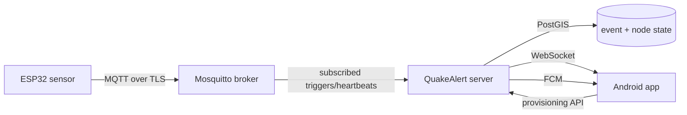

# QuakeAlert26

QuakeAlert26 is an open-source earthquake early-warning prototype: ESP32-based seismic sensors publish shaking observations over MQTT, a Go server verifies and tracks events, and an Android app delivers warnings to users.

The project exists to explore low-cost, community-deployable early warning. A few seconds of notice before strong shaking can let people take cover, stop machinery, or trigger automated responses. This repository contains the full system — sensor firmware, backend, and mobile client — as built and operated by the project so far.

> **Safety status.** This is experimental software, not a certified public warning service. Real-earthquake performance has not yet been demonstrated, and nothing here guarantees detection, timely delivery, or coverage. Do not rely on it as your only source of earthquake warning. See [Project status and limitations](#project-status-and-limitations).

## Overview

When the ground shakes near a sensor, the system moves through four stages:

1. **Sense.** An ESP32 board with an MPU6050 accelerometer continuously monitors ground motion with an STA/LTA onset detector. On a confirmed onset it publishes signed trigger messages.
2. **Verify.** The Go server checks each trigger's HMAC signature, rejects replays and stale data, and correlates independent observations.
3. **Track.** Verified triggers advance an event lifecycle (detected → unconfirmed → confirmed → resolved) with durable state in PostGIS.
4. **Warn.** Confirmed events are dispatched over WebSocket and Firebase Cloud Messaging; the Android app raises a full-screen alert, including a trusted-local path for the designated Admin Node's area.

## Architecture



- **Transport.** Nodes publish to `sensor/+/trigger` and `sensor/+/heartbeat` (QoS 0 from the device; the server subscribes with a persistent QoS 1 session). Payloads follow [`contracts/mqtt/`](contracts/mqtt/).
- **Trust.** Each node holds a per-device HMAC secret, provisioned encrypted and verified server-side; an operator-verified Admin Node serves as the trusted reference station.
- **API.** The server exposes REST (`/healthz`, anonymous auth, node provisioning, event/timeline reads, operator admin routes) and a WebSocket stream, described in [`contracts/openapi/`](contracts/openapi/).
- **Canonical units.** PGA in gal, timestamps in milliseconds epoch UTC, distances in km.

## Repository structure

```text
.
├── firmware/            ESP32 sensor firmware (C++/Arduino, PlatformIO)
├── server/              Go backend: ingest, consensus, events, API, dispatch
├── android/             Kotlin Android client (Jetpack Compose)
├── deploy/              Production Docker Compose stack + operator scripts
├── docs/                Specifications, decisions, and planning notes
├── contracts/           Source-of-truth MQTT schemas, OpenAPI, DB migrations
├── LICENSING.md         Which license applies to which directory
├── THIRD_PARTY_NOTICES.md  Third-party dependencies and attributions
├── TRADEMARK.md         Trademark policy (separate from copyright)
├── SECURITY.md          How to report vulnerabilities
└── CONTRIBUTING.md      Contribution workflow
```

## Features

Implemented and covered by the current tree and its tests:

- STA/LTA onset detection on-device with peak-hold `PRELIM` / `FINAL` trigger publishes sharing one observation sequence.
- TLS MQTT ingest with per-node HMAC verification, anti-replay, and clock-skew rejection.
- Multi-stage event lifecycle with durable PostGIS state, replay, and timeline reads.
- Operator workflow: node provisioning, pending/verified states, Admin Node designation and revocation.
- Dispatch over WebSocket and FCM, including operator broadcasts and test alerts.
- Android client with live sensor map, warning UI, drill/test mode, background delivery, and offline-tolerant WebSocket reconnect.
- Device provisioning flow: SoftAP setup portal, server-issued node identity, NVS-backed configuration.
- Anonymous JWT auth, admin-key operator routes, rate limiting, and structured observability on the server.

## Getting started

Prerequisites depend on the component: Go 1.24 for the server, PlatformIO for firmware, and JDK 21 with the Android SDK for the app. Docker Compose is used for the full stack (PostGIS, Redis, Mosquitto, Caddy).

### Server

```bash
cd server
go build ./...
go test ./...
```

For the full stack, see [`deploy/README.md`](deploy/README.md):

```bash
cd deploy
cp .env.prod.example .env.prod   # fill in every required secret
chmod 600 .env.prod
docker compose -f docker-compose.prod.yml --env-file .env.prod up -d --build
```

### Firmware

```bash
cd firmware
cp src/secrets.h.example src/secrets.h   # fill in Wi-Fi, MQTT, HMAC key
./scripts/check-secrets.sh                # preflight before flashing
pio run                                   # build
# pio run -t upload                       # flash (requires connected hardware)
```

Device setup (SoftAP portal, node identity, first boot) is described in [`firmware/AUDIT.md`](firmware/AUDIT.md) and [`docs/ESP32_SYSTEM_DESIGN.md`](docs/ESP32_SYSTEM_DESIGN.md).

### Android

```bash
cd android
./gradlew assembleDebug
```

The debug APK is produced under `app/build/outputs/apk/debug/`. Unit tests: `./gradlew testDebugUnitTest`. FCM push requires an (uncommitted) `google-services.json`; without it the app builds and runs with WebSocket alerts only — see [`docs/FIREBASE_SETUP.md`](docs/FIREBASE_SETUP.md).

## Configuration

All secrets (database password, master key, JWT secret, admin key, MQTT passwords, signing keys) are supplied through the environment or local untracked files — never committed. The authoritative variable lists live in [`deploy/.env.prod.example`](deploy/.env.prod.example) and [`firmware/src/secrets.h.example`](firmware/src/secrets.h.example). Tunables are documented alongside the code and in [`docs/`](docs/).

## Testing

- Server: `cd server && go test ./...` (plus `go vet ./...`).
- Firmware: host-side canonical/onset tests via `firmware/scripts/canonical-host-test.sh`; on-device behavior is validated on the bench.
- Android: `./gradlew testDebugUnitTest` from `android/`.
- Contract conformance: `bash server/scripts/check_contracts.sh`.

Automated tests verify engineering behavior (parsing, verification, lifecycle, API contracts). They do not prove real-world earthquake detection.

## Documentation

- [System specification](docs/SYSTEM_SPEC.md) and [client specification](docs/CLIENT_SPEC.md)
- [ESP32 system design](docs/ESP32_SYSTEM_DESIGN.md) and [firmware audit/provisioning notes](firmware/AUDIT.md)
- [Firebase setup](docs/FIREBASE_SETUP.md)
- [Server deployment](deploy/README.md)
- [Security policy](SECURITY.md) · [Contributing](CONTRIBUTING.md)
- [Licensing map](LICENSING.md) · [Third-party notices](THIRD_PARTY_NOTICES.md) · [Trademark policy](TRADEMARK.md)

## Security

Report suspected vulnerabilities privately, not through public issues — see [SECURITY.md](SECURITY.md). Never commit secrets, tokens, keystores, or service-account files; the ignore rules refuse the known-sensitive paths.

## Contributing

Contributions are welcome under the project's contribution guidelines — see [CONTRIBUTING.md](CONTRIBUTING.md). Architectural and behavioral decisions are owner-governed and recorded in `docs/DECISIONS.md`; propose before implementing.

## Licensing

- Firmware: [GPL-3.0-or-later](firmware/LICENSE)
- Server and deployment: [AGPL-3.0-or-later](server/LICENSE)
- Android: [GPL-3.0-or-later](android/LICENSE), with the [Google Play Services linking exception](android/LICENSE-EXCEPTION) for the single-APK distribution
- Third-party dependencies: [THIRD_PARTY_NOTICES.md](THIRD_PARTY_NOTICES.md)
- Trademark (name, logo, "Official QuakeAlert Node"): [TRADEMARK.md](TRADEMARK.md) — separate from copyright
- `docs/`, `contracts/`, and repository meta: license pending, all rights reserved for now — see [LICENSING.md](LICENSING.md)

## Project status and limitations

**Verified.** Multi-component builds (server, firmware, Android) pass with automated unit, contract, and host-side tests; MQTT/TLS ingest with HMAC verification, node provisioning and verification, Admin Node workflow, database migrations, and the licensed release structure have been exercised against live staging/production infrastructure.

**Not yet established.** Real seismic-event performance (detection reliability, warning lead time, false-alarm rate), background notification behavior across device states and networks at scale, and long-term sensor stability remain field-validation work. Treat any warning from this system as supplementary until such evidence exists.

## Maintainer

QuakeAlert26 is maintained by the repository owner ([banana-pixel](https://github.com/banana-pixel)). For questions and contributions, use the repository's issues and the process in [CONTRIBUTING.md](CONTRIBUTING.md).
